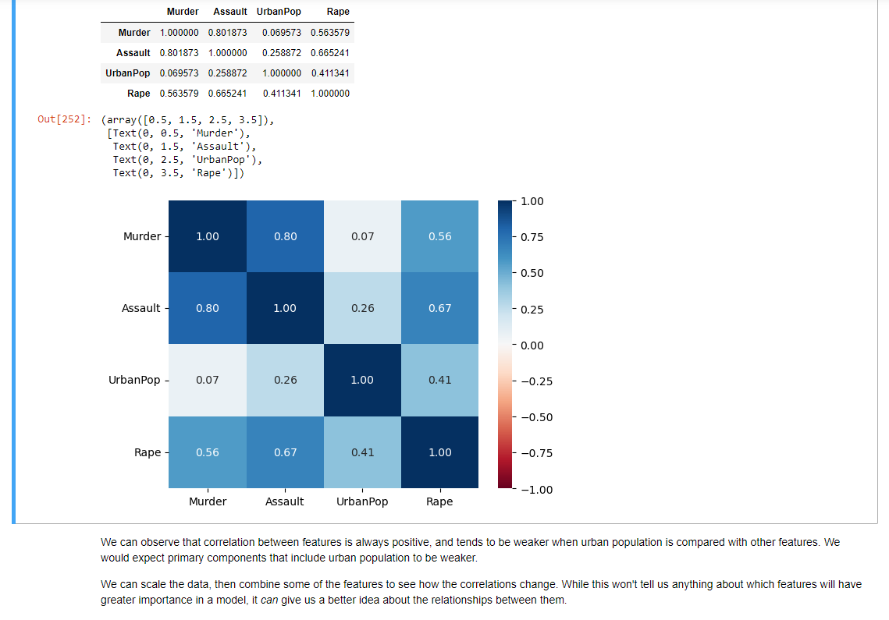

### Title: Unsupervised Learning Final Project
#### Date: 2023-01-24
#### Author: Jordaan Clarke 

#### Description:
An unsupervised learning project using k-means, hierarchical clustering, and principal component analysis (PCA). The dataset used for this is `UsArrests.csv`. The point of this project was to explore all unsupervised techniques learnt and apply them to new data, trying to find the optimal number of clusters. 

#### Installation: 
This project is written in Python 3.8.10 and saved in the `.ipynb` format, for Jupyter Notebook 6.4.12. 
Libraries used include: Numpy, Pandas, Matplotlib, Sklearn and Sci-py. The distribution used to set this up was Anaconda 2.3.2 [Individual Edition].

The latest distribution can be found here: https://www.anaconda.com/products/distribution

#### Usage: 
The project is not interactive, it only needs to be run in Jupyter Notebook.

